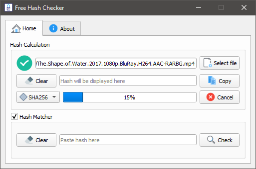

  <strong>:star: Free Hash Checking Tool :star:</strong> 
  A simple and elegant open-source hash checker software. 
  Available for Linux and Windows both.

 

  <!-- Version -->
  
  <!-- License -->
  

  This Hash Checker Tool that could. Built with ❤︎ by
    <a href="https://github.com/Rizwan-Hasan/">Rizwan Hasan</a> and
    <a href="https://github.com/Rizwan-Hasan/Free-Hash-Checker/graphs/contributors">
      contributors
    </a>
  

## Screenshot

  

## Features

- MD5
- SHA1
- SHA224
- SHA384
- SHA256
- SHA512
- Hash Matching

## Credits

Icons made by <a href="https://icons8.com/">Icons8</a>

Logo made by <a href="https://github.com/skinan">Sakib Khan Inan</a>

## License

[**MIT**](LICENSE).
