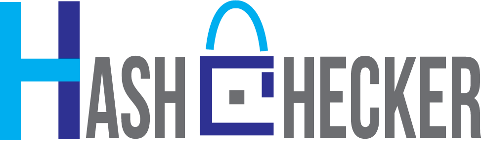

  <strong>:star: Free Hash Checking Tool :star:</strong> 
  A simple and elegant open-source hash checker software. 
  Available for Linux and Windows both.

 

  <!-- Version -->
  
  <!-- License -->
  

  This Hash Checker Tool that could. Built with ❤︎ by
    <a href="https://github.com/Rizwan-Hasan/">Rizwan Hasan</a> and
    <a href="https://github.com/Rizwan-Hasan/Free-Hash-Checker/graphs/contributors">
      contributors
    </a>
  

## Screenshot

## Features

- Realtime preview (WYSIWYG) and a clean and simple interface to get a distraction-free writing experience.
- Support [CommonMark Spec](https://spec.commonmark.org/0.29/), [GitHub Flavored Markdown Spec](https://github.github.com/gfm/) and selective support [Pandoc markdown](https://pandoc.org/MANUAL.html#pandocs-markdown).
- Markdown extensions such as math expressions (KaTeX), front matter and emojis.
- Support paragraphs and inline style shortcuts to improve your writing efficiency.
- Output **HTML** and **PDF** files.
- Various themes: **Cadmium Light**, **Material Dark** etc.
- Various editing modes: **Source Code mode**, **Typewriter mode**, **Focus mode**.

## Credits

Icons made by <a href="https://icons8.com/">Icons8</a>

Logo made by <a href="https://github.com/skinan">Sakib Khan Inan</a>

## License

[**MIT**](LICENSE).
